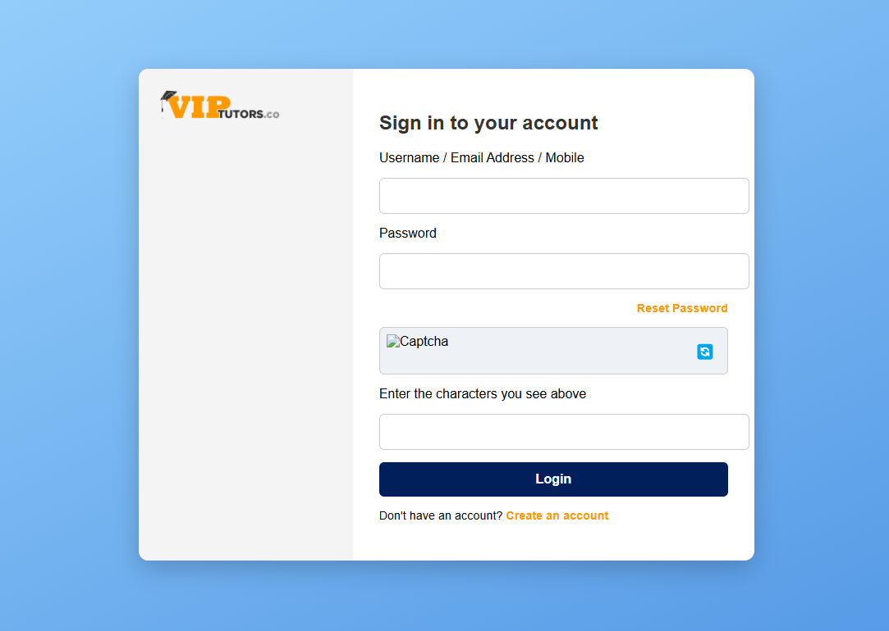
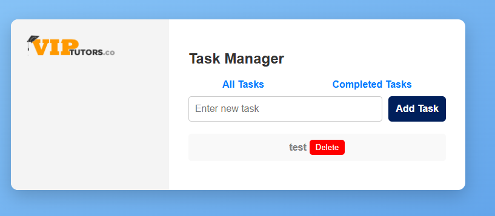
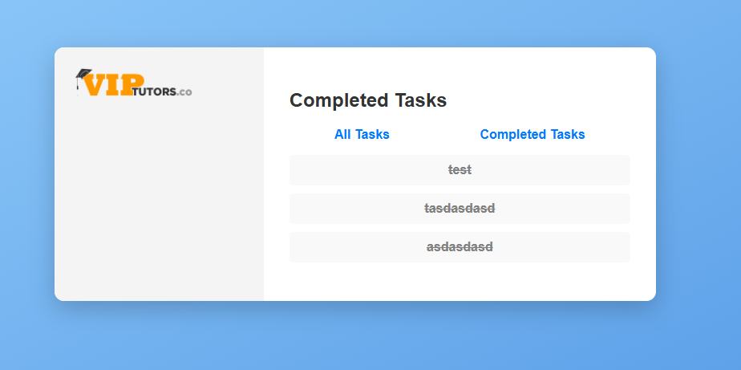

# Vue Task Manager

## Installation and Setup

### Prerequisites

Ensure you have the following installed:

- [Node.js](https://nodejs.org/) (LTS version recommended)
- [npm](https://www.npmjs.com/) or [yarn](https://yarnpkg.com/)
- Vue CLI (if not installed, run `npm install -g @vue/cli`)

### Steps to Install and Run

1. **Clone the repository:**
   ```sh
   git clone <repo-url>
   cd vue-task-manager
   ```
2. **Install dependencies:**
   ```sh
   npm install
   ```
3. **Run the development server:**
   ```sh
   npm run serve
   ```
4. **Access the app:**
   Open `http://localhost:8080/` in your browser.

---

## Project Structure

```
vue-task-manager/
│-- src/
│   │-- assets/
│   │-- components/
│   │-- views/
│   │-- store.js
│   │-- router.js
│   │-- App.vue
│   │-- main.js
│-- public/
│-- package.json
│-- tailwind.config.js
│-- postcss.config.js
│-- README.md
```

---

## Screenshots

### **Login Page**



### **Task Manager - All Tasks View**



### **Task Manager - Completed Tasks View**



---

## Coding Practices Applied

### **1. Vue 3 with Composition API**

- Uses Vue 3's Composition API for a modular and scalable architecture.
- Stores application state using **Pinia** for better reactivity and persistence.

### **2. State Management (Pinia)**

- Centralized state management with **Pinia**.
- Tasks persist using **localStorage**.

### **3. Routing (Vue Router)**

- Implements **Vue Router** for navigation between `All Tasks` and `Completed Tasks` pages.
- Uses lazy loading for better performance.

### **4. Tailwind CSS for Styling**

- Uses **Tailwind CSS** for a modern, responsive, and maintainable UI.
- Utility classes ensure consistency and reduce custom CSS overhead.

### **5. Clean Code Principles**

- Code follows best practices: modular, reusable components.
- Uses **scoped styles** and **CSS utility classes** for maintainability.
- Implements **error handling** and **form validation** for robustness.

### **6. Project Scalability & Maintainability**

- Organized **folder structure** for components, views, and store.
- Uses **ESLint** for code consistency and linting.
- Follows **semantic HTML and accessibility best practices**.

---

## Features Implemented

- ✅ **Task List Page** (`/`): Displays all tasks (completed & pending).
- ✅ **Completed Tasks Page** (`/completed`): Shows only completed tasks.
- ✅ **Add New Task**: Input field and button for adding tasks.
- ✅ **Mark as Completed**: Button to mark tasks as done.
- ✅ **Delete Task**: Option to remove tasks.
- ✅ **Navigation Bar**: Quick access to different task views.
- ✅ **State Persistence**: Tasks remain saved after page refresh.

---
